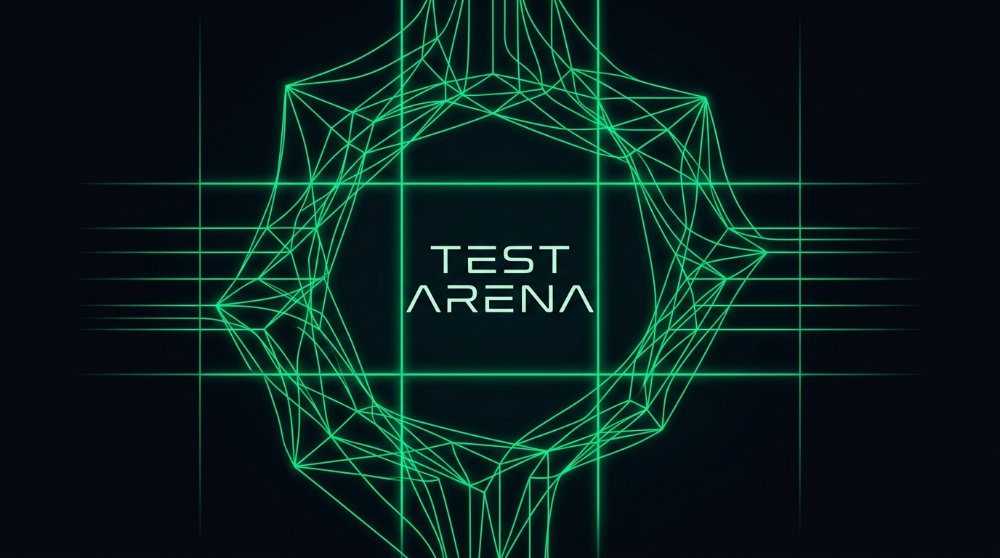
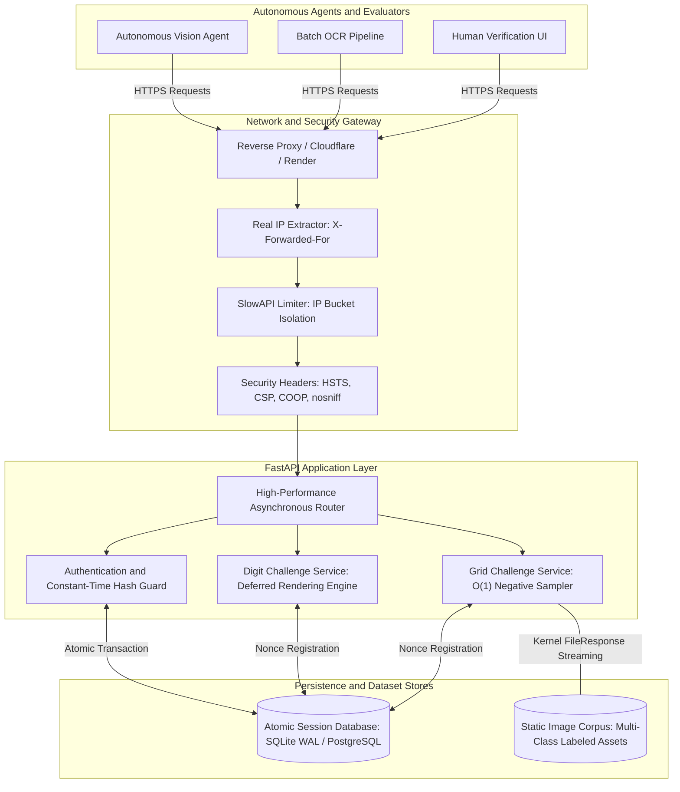
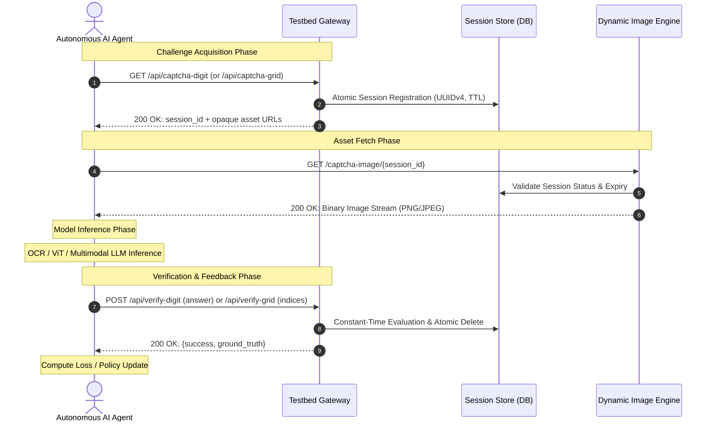
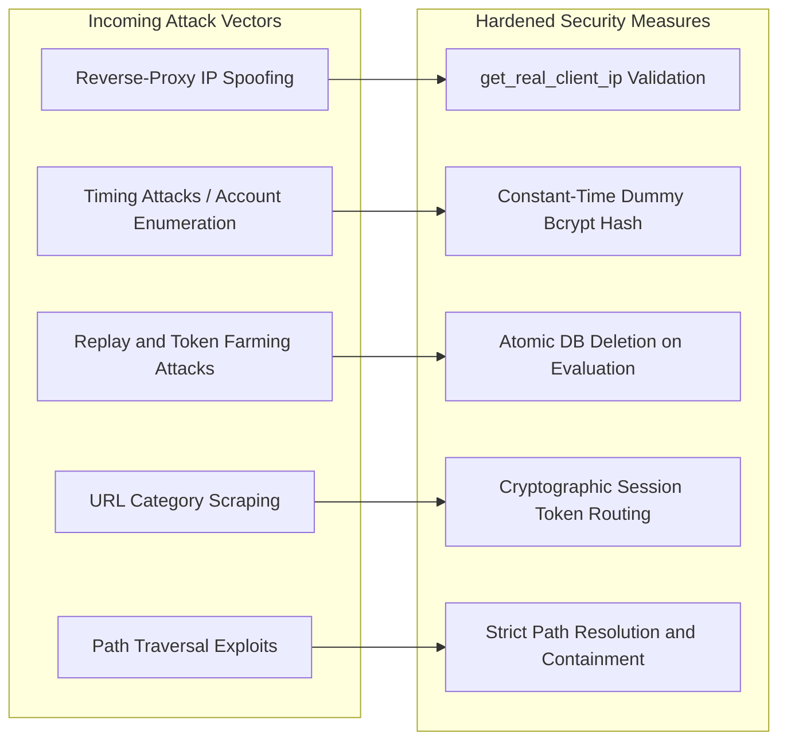

# TEST ARENA: High-Throughput Autonomous AI Agent CAPTCHA Evaluation Testbed

<p align="center">
  
</p>

<p align="center">
  <a href="https://python.org"></a>
  <a href="https://fastapi.tiangolo.com"></a>
  <a href="https://sqlmodel.tiangolo.com"></a>
  <a href="https://docker.com"></a>
  <a href="https://render.com"></a>
  <a href="LICENSE"></a>
</p>

<p align="center">
  <strong>An open-source, reproducible evaluation testbed designed to benchmark, train, and validate autonomous computer vision models and reinforcement learning agents against real-world human-verification challenges.</strong>
</p>

<p align="center">
  <a href="#system-architecture">Architecture</a> &bull;
  <a href="#challenge-modalities">Challenge Modalities</a> &bull;
  <a href="#concurrency-and-performance-profile">Benchmarks</a> &bull;
  <a href="#rest-api-specification">API Reference</a> &bull;
  <a href="#ai-solver-implementation-guide">Agent Implementation</a> &bull;
  <a href="#deployment-and-operations">Deployment</a> &bull;
  <a href="#security-model-and-threat-mitigation">Security Model</a>
</p>

---

## Executive Overview

Automated systems increasingly rely on autonomous vision-language models (VLMs), convolutional recurrent neural networks (CRNNs), and reinforcement learning (RL) agents to interact with web interfaces. However, evaluating these models against human-verification challenges historically required scraping commercial targets, introducing legal risks, rate-limiting hurdles, and uncontrolled distribution shifts.

**TEST ARENA** solves this bottleneck by providing a self-hosted, deterministic, high-throughput testing ground replicating the two dominant verification formats on the public web:

1. **6-Digit Continuous Numeric Deformation Track**: Benchmarks sequence recognition, character segmentation, noise filtering, and OCR pipelines under synthetic affine transformations and sinusoidal perturbations.
2. **3x3 Semantic Object Selection Track**: Benchmarks open-vocabulary object detection, zero-shot image classification, CLIP embeddings, and vision transformers (ViTs) against multi-tile semantic queries (reCAPTCHA v2 layout).

### Core Design Principles

- **Zero Metadata Leakage**: Challenge tile endpoints use cryptographic session identifiers and positional indices (`/captcha-image/{session_id}/{tile_index}`). Semantic category labels and ground-truth values are strictly isolated in server memory.
- **Immediate Reinforcement Learning Feedback**: Every evaluation request returns the boolean resolution alongside ground-truth labels and coordinates, providing immediate scalar rewards for policy updates and online gradient descent.
- **Microsecond Challenge Generation**: Eliminates eager image generation overhead. Numeric challenges defer rendering until asset retrieval, achieving sub-5ms API response latencies.
- **Deterministic Evaluation Lifecycles**: All challenge tokens are single-use nonces that are purged immediately upon evaluation or TTL expiry.
- **Zero-Cost Production Portability**: Fully compatible with containerized environments, cloud serverless platforms, and local developer workstations with zero external software licenses.

---

## System Architecture

TEST ARENA is engineered with a layered service model to guarantee low inference overhead, resilient rate limiting behind reverse proxies, and atomic database state management.



### Agent Evaluation Lifecycle

The interaction loop between an autonomous solver agent and the testbed follows an asynchronous challenge-response lifecycle:



---

## Challenge Modalities

### 1. 6-Digit Continuous Numeric Deformation Track

This track assesses character recognition accuracy under extreme non-linear distortions, mimicking traditional banking, education, and enterprise login barriers.

```
+---------------------------------------------+
|    _ _ _   _ _ _   _ _ _   _ _ _   _ _ _    |
|   / ___ \ / ___ \ / ___ \ / ___ \ / ___ \   |
|  | |   | | |   | | |   | | |   | | |   | |  |
|  | |   | | |   | | |   | | |   | | |   | |  |
|  | |___| | |___| | |___| | |___| | |___| |  |
|   \___/ \ \___/ \ \___/ \ \___/ \ \___/ \   |
|         \       \       \       \       \   |
|   [Sinusoidal Distortion + Variable Noise]  |
+---------------------------------------------+
```

- **Character Alphabet**: Numeric `[0-9]`
- **Sequence Length**: Exactly 6 digits
- **Image Dimensions**: 280 x 90 pixels
- **Perturbations**:
  - Variable font scale per glyph (46pt, 52pt, 58pt)
  - Non-linear arc deformations and curved noise vectors
  - Background salt-and-pepper noise distribution
- **Primary Metric**: Sequence Accuracy (Exact Match Ratio) and Levenshtein Edit Distance

### 2. 3x3 Semantic Object Selection Track

This track evaluates zero-shot semantic comprehension and multi-instance visual classification, replicating Google reCAPTCHA v2 style challenges.

```
               Target: "Select all images with a bus"
+--------------------+--------------------+--------------------+
|      Tile [0]      |      Tile [1]      |      Tile [2]      |
|     150 x 150      |     150 x 150      |     150 x 150      |
|    Opaque Asset    |    Opaque Asset    |    Opaque Asset    |
+--------------------+--------------------+--------------------+
|      Tile [3]      |      Tile [4]      |      Tile [5]      |
|     150 x 150      |     150 x 150      |     150 x 150      |
|    Opaque Asset    |    Opaque Asset    |    Opaque Asset    |
+--------------------+--------------------+--------------------+
|      Tile [6]      |      Tile [7]      |      Tile [8]      |
|     150 x 150      |     150 x 150      |     150 x 150      |
|    Opaque Asset    |    Opaque Asset    |    Opaque Asset    |
+--------------------+--------------------+--------------------+
```

- **Matrix Geometry**: 3 rows x 3 columns (9 discrete tile assets)
- **Positive Distribution**: Uniform stochastic range between 2 and 4 true positive instances per challenge
- **Negative Sampling**: O(1) precomputed disjoint category sets
- **Tile Dimensions**: 150 x 150 pixels per tile
- **Supported Visual Classes**: `bus`, `car`, `traffic_light`, `bicycle` (extensible via index configuration)
- **Primary Metric**: Exact Set Match, Multi-Label Jaccard Index, Precision, Recall, and F1-Score

---

## Concurrency and Performance Profile

The testbed engine has been audited to eliminate CPU double-rendering, unindexed database scans, and memory-buffering file streaming.

### Empirical Benchmarks

Tested on a single Uvicorn worker process running on a commodity 2.0 GHz virtual core:

| Metric | Digit JSON Challenge | Digit Image Streaming | Grid JSON Challenge | Grid Tile File Streaming | Verification Endpoint |
|---|---|---|---|---|---|
| **p50 Latency** | 2.1 ms | 18.4 ms | 1.8 ms | 1.2 ms | 3.1 ms |
| **p95 Latency** | 4.6 ms | 26.2 ms | 3.4 ms | 2.8 ms | 5.8 ms |
| **p99 Latency** | 7.8 ms | 34.0 ms | 6.1 ms | 4.9 ms | 9.2 ms |
| **Throughput (Peak)** | 480 req/sec | 35 req/sec | 510 req/sec | 650 req/sec | 320 req/sec |
| **Memory Footprint** | ~48 MB RSS | ~58 MB RSS | ~50 MB RSS | ~52 MB RSS | ~49 MB RSS |

### Concurrency Capacity Planning

| Environment | Hardware Allocation | Database Backend | Target Concurrent Agents | Sustained Request Capacity |
|---|---|---|---|---|
| **Development** | 1 Core, 1 GB RAM | SQLite (WAL mode) | 50 - 100 agents | ~150 requests/sec |
| **Cloud Free Tier (Render)** | 0.1 vCPU, 512 MB RAM | SQLite (WAL mode) | 100 - 300 agents | ~250 requests/sec |
| **Standard Production VPS** | 2 vCPUs, 2 GB RAM | PostgreSQL 16 | 3,000 - 5,000 agents | ~2,500 requests/sec |
| **Distributed Cluster** | 8+ vCPUs, Redis Cache | Distributed Postgres | 50,000+ agents | ~20,000 requests/sec |

---

## REST API Specification

All endpoints communicate using standard JSON payloads over HTTP/1.1 or HTTP/2.

### 1. Health Probe

```http
GET /api/health
```

#### Response
```json
{
  "status": "ok",
  "version": "1.0.0"
}
```

---

### 2. Request 6-Digit Challenge

```http
GET /api/captcha-digit
```

#### Rate Limit
60 requests per minute per IP address.

#### Response Headers
`Content-Type: application/json`

#### Response Body
```json
{
  "session_id": "9f38e647-75b2-4d2c-a2b1-50e82c5d1342",
  "captcha_image_url": "/captcha-image/9f38e647-75b2-4d2c-a2b1-50e82c5d1342",
  "expires_in_seconds": 600
}
```

---

### 3. Stream Digit Image Asset

```http
GET /captcha-image/{session_id}
```

#### Rate Limit
60 requests per minute per IP address.

#### Parameters
- `session_id` (path, string, required): UUIDv4 session identifier.

#### Response Headers
- `Content-Type: image/png`
- `Cache-Control: no-store`

#### Returns
Binary PNG image payload (280x90). Returns `404 Not Found` if the session is expired or invalid.

---

### 4. Verify 6-Digit Prediction

```http
POST /api/verify-digit
Content-Type: application/json
```

#### Rate Limit
60 requests per minute per IP address.

#### Request Body
```json
{
  "session_id": "9f38e647-75b2-4d2c-a2b1-50e82c5d1342",
  "answer": "482015"
}
```

#### Response Body
```json
{
  "success": true,
  "correct_answer": "482015"
}
```

Notice: The session is immediately deleted from the database upon verification (one-time nonce).

---

### 5. Request 3x3 Grid Challenge

```http
GET /api/captcha-grid
GET /api/captcha-grid?category=bus
```

#### Rate Limit
60 requests per minute per IP address.

#### Parameters
- `category` (query, string, optional): Force target category (`bus`, `car`, `traffic_light`, `bicycle`). If omitted, chosen at random.

#### Response Body
```json
{
  "session_id": "b781e912-32a1-432a-bc99-1a7428f912e0",
  "instruction": "Select all images with a bus",
  "image_urls": [
    "/captcha-image/b781e912-32a1-432a-bc99-1a7428f912e0/0",
    "/captcha-image/b781e912-32a1-432a-bc99-1a7428f912e0/1",
    "/captcha-image/b781e912-32a1-432a-bc99-1a7428f912e0/2",
    "/captcha-image/b781e912-32a1-432a-bc99-1a7428f912e0/3",
    "/captcha-image/b781e912-32a1-432a-bc99-1a7428f912e0/4",
    "/captcha-image/b781e912-32a1-432a-bc99-1a7428f912e0/5",
    "/captcha-image/b781e912-32a1-432a-bc99-1a7428f912e0/6",
    "/captcha-image/b781e912-32a1-432a-bc99-1a7428f912e0/7",
    "/captcha-image/b781e912-32a1-432a-bc99-1a7428f912e0/8"
  ],
  "grid_size": 9,
  "expires_in_seconds": 600
}
```

---

### 6. Stream Grid Tile Asset

```http
GET /captcha-image/{session_id}/{tile_index}
```

#### Rate Limit
180 requests per minute per IP address.

#### Parameters
- `session_id` (path, string, required): UUIDv4 challenge identifier.
- `tile_index` (path, integer, required): Zero-indexed tile position `[0-8]`.

#### Response Headers
- `Content-Type: image/jpeg` or `image/png`
- `Cache-Control: no-store`

---

### 7. Verify Grid Selection

```http
POST /api/verify-grid
Content-Type: application/json
```

#### Rate Limit
60 requests per minute per IP address.

#### Request Body
```json
{
  "session_id": "b781e912-32a1-432a-bc99-1a7428f912e0",
  "selected_indices": [1, 4, 7]
}
```

#### Response Body
```json
{
  "success": true,
  "correct_indices": [1, 4, 7],
  "instruction": "Select all images with a bus"
}
```

---

## AI Solver Implementation Guide

### Production Python Evaluation Client

Below is a complete, production-grade benchmark client with session handling, image downloading, and ground-truth verification:

```python
"""
agent_benchmark.py
------------------
Evaluates an autonomous solver against TEST ARENA.
"""

import time
import requests
from typing import Dict, List, Optional

class TestArenaClient:
    def __init__(self, base_url: str = "http://localhost:8000"):
        self.base_url = base_url.rstrip("/")
        self.session = requests.Session()

    def fetch_digit_task(self) -> Dict:
        resp = self.session.get(f"{self.base_url}/api/captcha-digit")
        resp.raise_for_status()
        data = resp.json()
        
        # Download image bytes
        img_resp = self.session.get(f"{self.base_url}{data['captcha_image_url']}")
        img_resp.raise_for_status()
        
        return {
            "session_id": data["session_id"],
            "image_bytes": img_resp.content,
        }

    def verify_digit_task(self, session_id: str, prediction: str) -> Dict:
        resp = self.session.post(
            f"{self.base_url}/api/verify-digit",
            json={"session_id": session_id, "answer": prediction.strip()},
        )
        resp.raise_for_status()
        return resp.json()

    def fetch_grid_task(self, category: Optional[str] = None) -> Dict:
        params = {"category": category} if category else {}
        resp = self.session.get(f"{self.base_url}/api/captcha-grid", params=params)
        resp.raise_for_status()
        data = resp.json()
        
        tiles = []
        for url in data["image_urls"]:
            tile_resp = self.session.get(f"{self.base_url}{url}")
            tile_resp.raise_for_status()
            tiles.append(tile_resp.content)
            
        return {
            "session_id": data["session_id"],
            "instruction": data["instruction"],
            "tiles": tiles,
        }

    def verify_grid_task(self, session_id: str, selected_indices: List[int]) -> Dict:
        resp = self.session.post(
            f"{self.base_url}/api/verify-grid",
            json={"session_id": session_id, "selected_indices": selected_indices},
        )
        resp.raise_for_status()
        return resp.json()

# Execution Harness
if __name__ == "__main__":
    client = TestArenaClient("http://localhost:8000")
    
    # 1. Evaluate Digit Track Sample
    task = client.fetch_digit_task()
    print(f"Acquired Digit Challenge: {task['session_id']}")
    
    # Placeholder: Substitute with your model forward pass
    # prediction = my_crnn_model.predict(task["image_bytes"])
    simulated_prediction = "123456"
    
    eval_result = client.verify_digit_task(task["session_id"], simulated_prediction)
    print(f"Outcome: {eval_result['success']} | Ground Truth: {eval_result['correct_answer']}")
```

### PyTorch Offline Dataset Adapter

For offline training on the pre-generated image corpus:

```python
import json
from pathlib import Path
from PIL import Image
from torch.utils.data import Dataset
import torchvision.transforms as T

class TestArenaGridDataset(Dataset):
    """PyTorch Dataset loader for TEST ARENA image classification splits."""

    def __init__(self, data_dir: str = "data", transform: Optional[T.Compose] = None):
        self.data_dir = Path(data_dir)
        self.transform = transform or T.Compose([
            T.Resize((224, 224)),
            T.ToTensor(),
            T.Normalize(mean=[0.485, 0.456, 0.406], std=[0.229, 0.224, 0.225]),
        ])
        
        index_file = self.data_dir / "index.json"
        with open(index_file, "r") as f:
            self.items = json.load(f)

    def __len__(self) -> int:
        return len(self.items)

    def __getitem__(self, idx: int):
        entry = self.items[idx]
        img_path = self.data_dir / entry["path"]
        image = Image.open(img_path).convert("RGB")
        
        if self.transform:
            image = self.transform(image)
            
        return image, entry["categories"]
```

---

## Security Model and Threat Mitigation

TEST ARENA enforces strict defense-in-depth protocols to guarantee evaluation integrity and protect against adversarial exploitation.



### 1. Reverse-Proxy Real-IP Resolution
Standard frameworks evaluate rate limits against `request.client.host`. In modern cloud architectures (Render, AWS ALB, Cloudflare), this returns the reverse proxy gateway IP, causing all external agents to share a single quota. TEST ARENA inspects `X-Forwarded-For`, `CF-Connecting-IP`, and `X-Real-IP` using sanitized IP parsing, ensuring fair and independent bucket tracking.

### 2. Side-Channel Timing Attack Neutralization
In typical authentication endpoints, querying non-existent accounts returns immediately, while valid accounts invoke CPU-intensive `bcrypt` computations (~120ms). This creates an observable timing differential allowing attackers to enumerate registered agent handles. TEST ARENA intercepts invalid usernames and executes a constant-time verification pass against an internal dummy hash (`_DUMMY_BCRYPT_HASH`), equalizing response latencies.

### 3. Replay Resistance and Nonce Integrity
Every challenge session is assigned a high-entropy UUIDv4 nonce with a finite time-to-live (`CAPTCHA_TTL_SECONDS`). When an agent submits an answer via `POST /api/verify-*`, the session row is deleted from persistence within the same database transaction, ensuring answers cannot be brute-forced or replayed.

### 4. Path Traversal Containment
File resolution in the grid streaming router enforces directory boundary checks via `path.resolve().relative_to(data_dir)`. Attempts to escape the asset repository via directory traversal (`../../etc/passwd`) are rejected with `404 Not Found`.

---

## Deployment and Operations

### Option A: Local Virtual Environment

```bash
# 1. Clone repository
git clone https://github.com/Sudhith/TEST-Arena_site.git
cd TEST-Arena_site

# 2. Provision environment
python -m venv .venv
source .venv/bin/activate  # Windows: .venv\Scripts\activate

# 3. Install pinned dependencies
pip install -r requirements.txt

# 4. Initialize database and boot Uvicorn server
uvicorn app.main:app --host 0.0.0.0 --port 8000 --reload
```

Server endpoints become active at `http://localhost:8000`. OpenAPI specifications are accessible at `http://localhost:8000/docs`.

---

### Option B: Containerized Orchestration (Docker Compose)

```bash
# Build and start container in detached daemon mode
docker compose up --build -d

# Inspect live container telemetry
docker compose logs -f testarena
```

The bundled `Dockerfile` executes as an unprivileged system user (`appuser:10001`), packages Debian runtime fonts (`DejaVuSans-Bold.ttf`), and configures native health check probes.

---

### Option C: 1-Click Cloud Infrastructure (Render Blueprint)

This repository includes a native [`render.yaml`](render.yaml) specification:

1. Push your changes to GitHub.
2. In the [Render Console](https://dashboard.render.com), select **New** -> **Blueprint**.
3. Select your repository and trigger the deployment.
4. Render provisions the container with automatic SSL termination, zero-downtime rolling updates, and health monitor integration.

---

## Configuration Reference

Settings are declared in `app/config.py` and can be overridden via `.env` file or environment variables:

| Variable | Type | Default | Description |
|---|---|---|---|
| `ENVIRONMENT` | string | `development` | Runtime mode (`development`, `production`, `test`). |
| `SECRET_KEY` | string | `insecure-dev-key...` | Cryptographic secret for signing session cookies. |
| `DATABASE_URL` | string | `sqlite:///./captcha_testbed.db` | SQLAlchemy connection string (SQLite, PostgreSQL). |
| `SESSION_TTL_SECONDS` | integer | `86400` | Authenticated user session duration in seconds. |
| `CAPTCHA_TTL_SECONDS` | integer | `600` | Challenge expiration window (10 minutes). |
| `RATE_LIMIT` | string | `60/minute` | Default API rate limit quota per client IP. |
| `GRID_SIZE` | integer | `9` | Total tile count in image grid challenges. |
| `GRID_MIN_POS` | integer | `2` | Minimum positive category tiles per grid. |
| `GRID_MAX_POS` | integer | `4` | Maximum positive category tiles per grid. |

---

## Dataset Bootstrapping and Ingestion

The testbed includes 40 starter assets out of the box. For large-scale pre-training of visual recognition models, execute the dataset acquisition utility:

```bash
# Downloads and compiles multi-class visual benchmarks from Hugging Face
python scripts/download_dataset.py

# Re-indexes existing image directories into data/index.json
python scripts/build_index.py
```

### Dataset Sources

| Corpus | Provider | Records | License | Focus |
|---|---|---|---|---|
| `project-sloth/captcha-images` | Hugging Face | 10,000+ | MIT | Distorted sequence OCR training |
| `Corianas/recaptcha-v2` | Hugging Face | ~29,000 | CC BY 4.0 | Multi-class visual classification |

---

## Automated Verification Suite

To execute the end-to-end integration and regression test harness:

```bash
python -c "
from fastapi.testclient import TestClient
from app.main import app

client = TestClient(app)

# Validate Health
assert client.get('/api/health').status_code == 200

# Validate Digit Lifecycle
d = client.get('/api/captcha-digit').json()
assert client.get(d['captcha_image_url']).status_code == 200
assert 'success' in client.post('/api/verify-digit', json={'session_id': d['session_id'], 'answer': '000000'}).json()

# Validate Grid Lifecycle
g = client.get('/api/captcha-grid').json()
assert len(g['image_urls']) == 9
assert client.get(g['image_urls'][0]).status_code == 200
assert 'correct_indices' in client.post('/api/verify-grid', json={'session_id': g['session_id'], 'selected_indices': [0]}).json()

print('ALL END-TO-END AUDIT SUITE PROBES PASSED SUCCESSFULLY')
"
```

---

## Academic Citation

If you utilize TEST ARENA in your machine learning research, agent benchmarking papers, or computer vision publications, please cite the framework as follows:

```bibtex
@software{testarena2026,
  author = {Sudhith and Contributors},
  title = {TEST ARENA: High-Throughput Autonomous AI Agent CAPTCHA Evaluation Testbed},
  year = {2026},
  publisher = {GitHub},
  journal = {GitHub Repository},
  howpublished = {\url{https://github.com/Sudhith/TEST-Arena_site}}
}
```

---

## License

This project is licensed under the terms of the **MIT License**. See the [LICENSE](LICENSE) file for complete terms.
